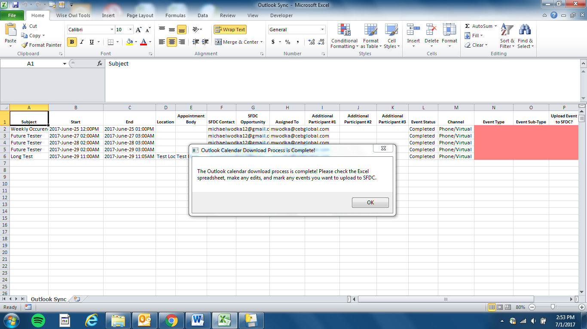
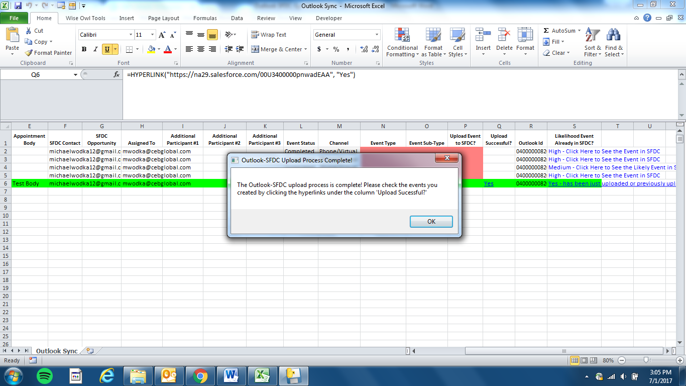

# python-outlook-calendar-sfdc-sync
This project allows you to download you calendar/appointments from Microsoft Outlook into an Excel spreadsheet and then
upload the appointment data as Salesforce events related to contacts and opportunties. The script is written in Python. The calendar download/upload processes are executed via a Python Ttkinter GUI application and simple-salesforce API call. This script can only be run on a Windows machine.

# Getting Started
You will need to install several python libraries to get this project running on your local Windows machine. You will also need to valid Salesforce account to be able to make the API calls when uploading calendar to Salesforce.

```
from tkinter import *                                   # for Tkinter GUI application
import tkinter as tk                                    # for Tkinter GUI application
import os                                               # for opening and closing files
import datetime as dt                                   # for using calendar dates as values
from dateutil.relativedelta import relativedelta        # for adding/subtracting dates from each other
import pytz                                             # for setting timezones for dates
from openpyxl import load_workbook                      # for downloading Pandas table into Excel workbook
import win32com.client                                  # for running Excel and Outlook applications from Python
import win32api                                         # for creating Windows pop-up messages
import xlrd                                             # for retrieving data from Excel cells
from simple_salesforce import Salesforce                # for running API calls to Salesforce
import pandas as pd                                     # for creating Pandas tables in Python
from openpyxl.styles import Font, Color, PatternFill    # for making design edits (color, font) in Excel workbook
import win32timezone                                    # for setting timezones for dates
```
You will also need to create a directory in your C-drive called "SFDC Outlook Synchronization" folder. You will need to create to sub-folders called "SFDC_Admin" and "Previous Uploads". Copy the "SFDC_Admin.xlsx" file into the "SFDC_Admin" folder and copy the "Outlook Sync.xlsx" file into the general "SFDC Outlook Synchronization" folder.

In the "SFDC_Admin.xlsx" file, you will need to enter SFDC username in cell B1, SFDC passwoard in cell B2, and SFDC Security token in cell B3. Please contact you SFDC administrator to find out this information if you don't know already.

# Running the Script
When you run the script, the Tkinter GUI application will initialize and present you with the following screen:


When running it the first time, you will want to select "Outlook Download" and then press "Ok" to start the calendar download process. We will explore the "Outlook SFDC Upload" button a little later.

Once you click the "Outlook Download" button, a second Tkinter GUI window will appear with the following screen:


In the first section, you have choices on whether to download your calendar based on pre-set date ranges (e.g., today, last week) or based on custom date ranges (08/01/XXXX - 09/05/XXXX). Click the corresponding green "Ok" button next to your selected choice to begin downloading your calendar.

The second section contains some advanced features such as including internal calendar events as well as downloading a shared calendar. ***Note: The internal calendar feature is based on analyzing appointment attendees' email domains and including events where everyone has a "cebglobal.com" domain (since "CEB Global" is the company I worked for when creating this script). By default, the script excludes events where everyone has "cebglobal.com", since we were only interested in external client meetings to sync with Salesforce. For the shared calendar option, you have the choice to download someone else’s calendar that you have full permissions to access. You will just type the name of person you want to download in the open text field below the header. If you leave the field blank, the tool will download your own calendar.

Once the download is complete (can take a few moments depending on the amount of data), you should see the following:



This is all of your date-specified Outlook calendar events downloaded into an Excel file. You’ll notice that the events are separated out into very specific fields (e.g., subject, start, end), which all map to SFDC event fields. These are all completely editable, so if you want the SFDC event to have a different subject/time/contact/etc., you can edit those fields directly in the spreadsheet. The mandatory fields that you have to fill out are the ‘Event Type’, ‘Event Sub-Type’, and ‘Upload Event to SFDC?’ fields (all highlighted in red). Just click the drop-downs in these fields for what types you want to specify and for the events you want to upload to SFDC, choose the ‘Yes’ option under ‘Upload Event to SFDC?’.

As you scroll to the right on the spreadsheet, you’ll also see a few additional columns called ‘Upload Successful?’, ‘Outlook Id’, and ‘Likelihood Event Already in SFDC?’.  The ‘Upload Successful?’ field will either be ‘Yes’ or ‘No” after you run the ‘Outlook SFDC Upload’ script. It’s blank when you just downloaded the calendar. The ‘Outlook Id’ field contains the unique Outlook Id for the event. This is important because we will be uploading this Id to the SFDC events to ensure the script will know which events we’ve uploaded vs. not uploaded to SFDC in the past, to avoid duplication and wasted effort. The last field ‘Likelihood Event Already in SFDC?’ has three options: “High”, “Medium”, and “Cannot Determine”. “High” means it’s very likely the event has already been uploaded in SFDC. “Medium” means medium likelihood. And “Cannot Determine” means the algorithm cannot determine if it has been uploaded or not. I highly recommend you check before if the events have been uploaded or not and not just rely on the recommendations.

Once you’ve selected the events you want to upload, run the script again and instead of choosing “Outlook Download”, change the drop-down to “Outlook SFDC Upload” and then click “Ok”. After a few moments this screen should pop up:



You’ll notice the events that you selected “Yes” under the column “Upload Event to SFDC?” will highlight green and a hyperlinked “Yes” will appear under the column, “Upload Successful?” if the event upload was successful. You can then click the hyperlink to see the event you just uploaded to SFDC.

So that’s it! You can follow this same process with the “Shared Calendar” option to upload events from a shared calendar you have full permissions to. Please note that when you download your calendar again, all data will be wiped from the Excel file and be replaced with the new calendar data. However, you can find previous uploads you’ve made in the following directory: C:\SFDC Outlook Synchronization\Previous Uploads. This will contain all the Excel files you’ve previously uploaded to SFDC with the dates/times of each upload.
# License
See the LICENSE file for license rights and limitations (MIT).
