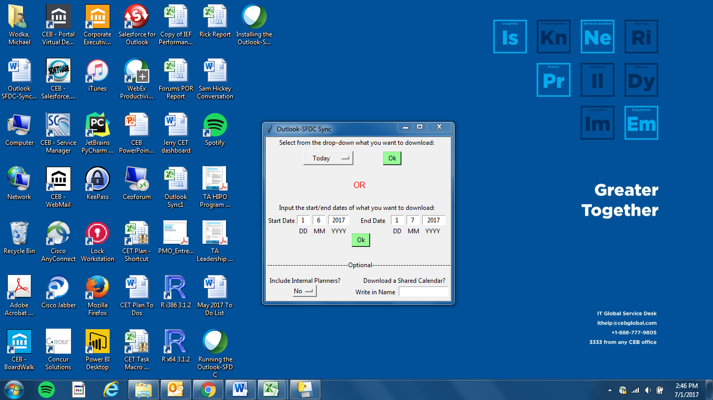

# python-outlook-calendar-sfdc-sync
This project allows you to download you calendar/appointments from Microsoft Outlook into an Excel spreadsheet and then
upload the appointment data to contacts and opportunties in Salesforce. The script is written in Python. The calendar download/upload
processes are executed via a Python Ttkinter GUI application and simple-salesforce script. This script can only be run on a Windows machine.

# Getting Started
You will need to install several python libraries to get this project running on your local Windows machine. You will also need to valid Salesforce account to be able to make the API calls when uploading calendar to Salesforce.

```
from tkinter import *                                   # for Tkinter GUI application
import tkinter as tk                                    # for Tkinter GUI application
import os                                               # for opening and closing files
import datetime as dt                                   # for using calendar dates as values
from dateutil.relativedelta import relativedelta        # for adding/subtracting dates from each other
import pytz                                             # for setting timezones for dates
from openpyxl import load_workbook                      # for downloading Pandas table into Excel workbook
import win32com.client                                  # for running Excel and Outlook applications from Python
import win32api                                         # for creating Windows pop-up messages
import xlrd                                             # for retrieving data from Excel cells
from simple_salesforce import Salesforce                # for running API calls to Salesforce
import pandas as pd                                     # for creating Pandas tables in Python
from openpyxl.styles import Font, Color, PatternFill    # for making design edits (color, font) in Excel workbook
import win32timezone                                    # for setting timezones for dates
```
You will also need to download the "SFDC Outlook Synchronization" folder and copy it directly into your C-drive.

# Running the Script
When you run the script, the Tkinter GUI application will initialize and present you with the following screen:


When running it the first time, you will want to select "Outlook Download" and then press "Ok" to start the calendar download process. We will explore the "Outlook SFDC Upload" button a little later.

Once you click the "Outlook Download" button, a second Tkinter GUI window will appear with the following screen:



In the first section, you have choices on whether to download your calendar based on pre-set date ranges (e.g., today, last week) or based on custom date ranges (08/01/XXXX - 09/05/XXXX). Click the corresponding green "Ok" button next to your selected choice to begin downloading your calendar.

The second section contains some advanced features such as including internal calendar events as well as downloading a shared calendar. ***Note: The internal calendar feature is based on analyzing appointment attendees' email domains and including events where everyone has a "cebglobal.com" domain (since "CEB Global" is the company I worked for when creating this script). By default, the script excludes events where everyone has "cebglobal.com", since we were only interested in external client meetings to sync with Salesforce.


# License
See the LICENSE file for license rights and limitations (MIT).
